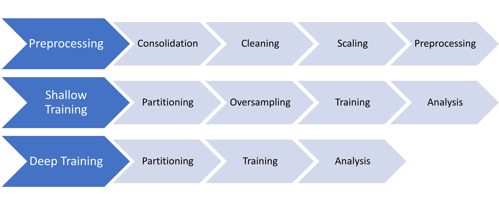

# EQUINOTHERAPY PILOT SLEEP

## How to execute

First its necessary to install Conda in order to execute the code.

1. Install libs on new environment:
   `conda env create --file environment.yml`
2. Activate the environment:
   `conda activate EQUINOTHERAPY_PILOT_SLEEP`
3. Execute whole project by running the main file:
   `python src/main.py`

### Specific libraries versions

In case environment.yml does not work, here are the specific versions of the libraries used in the project:

- **Python**: 3.11.5
- **Luigi**: 3.5.1
- **Scikit-learn**: 1.2.2
- **XGBoost**: 2.0.3
- **Catboost**: 1.2.5
- **Tensorflow**: 2.16.1
- **Keras**: 3.4.0
- **Numpy**: 1.26.4
- **Pandas**: 2.2.2
- **TQDM**: 4.66.4
- **Imbalanced-Learn**: 0.12.3
- **Seaborn**: 0.13.2

> _**Note:** Some libraries are OS-specific. For instance, on macOS, `tensorflow-macos` and `tensorflow-metal` are
required to enable GPU use._

## Pipelines Summaries

### Preprocessing Pipeline

| **Phase**         | **Description**                                                                                                                                                                                                                                                                                                               | **Script**                                                      |
|-------------------|-------------------------------------------------------------------------------------------------------------------------------------------------------------------------------------------------------------------------------------------------------------------------------------------------------------------------------|-----------------------------------------------------------------|
| **Consolidation** | The data obtained from the watches are matched with the stages obtained from polysomnography (PSG).                                                                                                                                                                                                                           | [consolidation.py](src/preprocessing_pipeline/consolidation.py) |
| **Cleaning**      | Two filters are applied to clean the data: - **Time Filter**: Only data between 20:00 and 12:00 is collected. - **HRR Filter**: Only windows of *w_size* and *w_overlap* are collected. Heart rate recovery is calculated in each window and if it exceeds the threshold, the window is not included in the final file. | [cleaning.py](src/preprocessing_pipeline/cleaning.py)           |
| **Scaling**       | The data is scaled to improve model performance. First, an adjustment of the median of the individual data for each patient is performed, then a global 'RobustScaler' is applied to the entire dataset.                                                                                                                      | [scaling.py](src/preprocessing_pipeline/scaling.py)             |
| **Preprocessing** | Feature extraction is performed (see [features.py](src/preprocessing_pipeline/features.py) for details). Then, the feature matrix of each patient is normalized using a StandardScaler (Z-score normalization).                                                                                                               | [preprocessing.py](src/preprocessing_pipeline/preprocessing.py) |

### Shallow Training Pipeline

| **Phase**        | **Description**                                                                                                                                                                                                                                                                           | **Script**                                              |
|------------------|-------------------------------------------------------------------------------------------------------------------------------------------------------------------------------------------------------------------------------------------------------------------------------------------|---------------------------------------------------------|
| **Partitioning** | Two validation methods are used: <ul><li>Stratified KFold with *n_splits* (see [luigi.cfg](luigi.cfg) to check value).</li><li>Leave-One-Participant-Out.</li></ul>                                                                                                                       | [partitioning.py](src/shallow_pipeline/partitioning.py) |
| **Oversampling** | To achieve a balanced dataset, the SMOTE algorithm is applied to the training set of both validation methods.                                                                                                                                                                             | [oversampling.py](src/shallow_pipeline/oversampling.py) |
| **Training**     | A list of models is trained using the training set of both validation methods. These models are defined in [models.py](src/shallow_pipeline/models.py). Parameter optimization is performed for each partition (fold or participant), and only the best model of each partition is saved. | [training.py](src/shallow_pipeline/training.py)         |
| **Analysis**     | Various analysis approaches are conducted in this phase: <ul><li>Comparative Boxplots.</li><li>Comparative Matrix between validation methods.</li><li>Confusion Matrix for each model.</li></ul>                                                                                          | [analysis.py](src/shallow_pipeline/analysis.py)         |

### Deep Training Pipeline

| **Phase**        | **Description**                                                                                                                                                                                                                                                                                                                                                                                                                                                                                                             | **Script**                                           |
|------------------|-----------------------------------------------------------------------------------------------------------------------------------------------------------------------------------------------------------------------------------------------------------------------------------------------------------------------------------------------------------------------------------------------------------------------------------------------------------------------------------------------------------------------------|------------------------------------------------------|
| **Partitioning** | Using a combination of the aforementioned validation methods, Leave-One-Participant-Out is used to divide the dataset into training and testing sets, then a Stratified KFold with *n_splits* (see [luigi.cfg](luigi.cfg) to check value) is used on the training set, creating the training and validation folds.                                                                                                                                                                                                          | [partitioning.py](src/deep_pipeline/partitioning.py) |
| **Training**     | Using a DataGenerator, the training and validation sets are fed to the model. This model might be one of three different versions (as seen in [lstm_creation.py](src/deep_pipeline/lstm_creation.py)), the selection is specified in [luigi.cfg](luigi.cfg), as well as the mode to train the model, which consists of the list of inputs which will be passed to the model. These inputs might be: <ol><li>ACCX, ACCY, ACCZ, and HR</li><li>ACCX, ACCY, ACCZ, ACC_MAGNITUDE, and HR</li><li>ACC_MAGNITUDE and HR</li></ol> | [training.py](src/deep_pipeline/training.py)         |
| **Analysis**     | Previously trained models are evaluated using the testing set. Then, Confussion Matrix are obtained.                                                                                                                                                                                                                                                                                                                                                                                                                        | [analysis.py](src/deep_pipeline/analysis.py)         |

## Experiments Summary

### Shallow Models

#### 1. Using all phases

| Round | Patients used | N Phases | Description                                                                                                                  |
|-------|---------------|----------|------------------------------------------------------------------------------------------------------------------------------|
| 1st   | All Patients  | 5        | Window Gaussian normalization, Individuals only, MinMaxScaler (0,1) on feature matrix, no Oversampling                       |
| 2nd   | All Patients  | 5        | Mean adjust, Global RobustScaler, MinMaxScaler (0,1) on feature matrix, Feature selection (ANOVA), Smote Oversampling        |
| 3rd   | All Patients  | 5        | Mean adjust, Global RobustScaler, StandardScaler (Gaussian) on feature matrix, Feature selection (ANOVA), Smote Oversampling | 
| 4th   | HQ Patients   | 5        | Mean adjust, Global RobustScaler, StandardScaler (Gaussian) on feature matrix, Feature selection (ANOVA), Smote Oversampling |
| 5th   | MLQ Patients  | 5        | Mean adjust, Global RobustScaler, StandardScaler (Gaussian) on feature matrix, Feature selection (ANOVA), Smote Oversampling |
| 6th   | All Patients  | 2        | Mean adjust, Global RobustScaler, StandardScaler (Gaussian) on feature matrix, Feature selection (ANOVA), Smote Oversampling |

### Deep Models

| Round  | Description                      |
|--------|----------------------------------|
| First  | 3DACC, HR and MAGACC with LSTM_1 |
| Second | 3DACC, HR with LSTM_1            |

    
    

